# RUET Guest Room

Welcome to the RUET Guest Room Application, a comprehensive platform for simplifying the process of booking guest rooms at RUET (Rajshahi University of Engineering & Technology).

## Table of Contents

- [Installation](#installation)
- [Introduction](#introduction)
- [Advantages](#advantages)
- [Tools and Technologies](#tools-and-technologies)
- [Project Diagram](#project-diagram)
- [Project Description](#project-description)
- [Database](#database)
- [Conclusion](#conclusion)

## Installation

Provide step-by-step instructions on how to install and set up your project locally. Include any prerequisites, dependencies, or environment variables that need to be configured.

```bash
# Clone the repository
git clone https://github.com/Sumon-Ali-1999/RUET_GuestRoom_Booking.git

# Navigate to the project directory
cd RUET_GuestRoom_Booking

# Install server dependencies
npm install

# Navigate to the client directory
cd client

# Install client dependencies
npm install

#Start the development server
npm run dev

Access the application by opening your browser and navigating to http://127.0.0.1:5173/

```

## Dependencies

To run this project make sure you have these dependencies:

### Frontend

- "@emailjs/browser": "^3.11.0"
- "antd": "^5.5.0"
- "axios": "^1.4.0"
- "moment": "^2.29.4"
- "react": "^18.2.0"
- "react-bootstrap": "^2.7.4"
- "react-dom": "^18.2.0"
- "react-router-dom": "^6.11.1"
- "react-spinners": "^0.13.8"
- "react-stripe-checkout": "^2.6.3"

### Backend

- "bcrypt": "^5.1.0"
- "dotenv": "^16.1.4"
- "express": "^4.18.2"
- "mongoose": "^7.1.1"
- "nodemon": "^2.0.22"
- "router": "^1.3.8"
- "stripe": "^12.5.0"
- "uuid": "^9.0.0"

## Introduction

This RUET (Rajshahi University of Engineering & Technology) Guest Room Booking Website is an online platform developed to streamline and automate the process of booking guest rooms within the RUET campus. There are two main users on this booking website, admin and guest. This booking website will automate all the features of RUET guest rooms. The admin can access all the functionalities without any kind of restrictions. The guests can create new accounts, book rooms, cancel bookings, and make payments. On the other hand, the admin can easily check bookings, add rooms, restrict users, and refund the money. The main aim of the entire activity is to automate the RUET guest room booking process.

## Advantages:

1. **Ease of Booking**: Users can easily book guest rooms from anywhere, at any time.
2. **Automated Efficiency**: The automated system significantly reduces the time required for booking and administrative tasks.
3. **Room Availability**: Users can quickly check room availability, minimizing potential conflicts.
4. **Secure Transactions**: Integrated payment gateways ensure safe and secure transactions.
5. **Flexible Booking Management**: Users have the flexibility to modify or cancel bookings within specified guidelines.
6. **User-Centric Design**: The website boasts a user-friendly interface that provides clear and comprehensive information.

## Tools and Technologies

### Frontend

- React
- Bootstrap
- React Bootstrap
- Ant Design (Antd)
- Axios
- Moment.js
- React Router DOM

### Backend

- Node.js
- Express.js
- MongoDB (Database)
- Mongoose (ODM)
- Bcrypt (Password Hashing)
- Stripe (Payment Gateway)
- UUID (Unique Identifier)

## Project Diagram

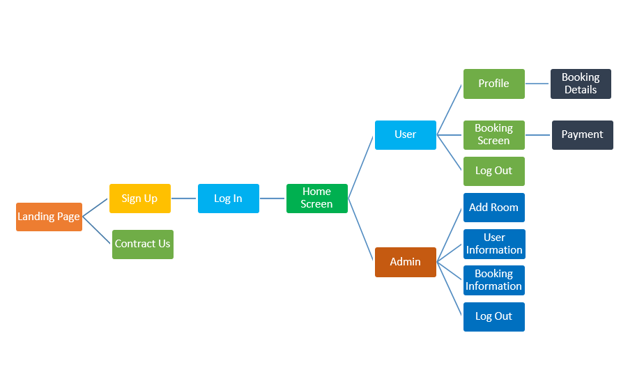

**Fig: Project Diagram of RUET Guest Room**

Here, a user can easily access the pages anytime with proper user authentication.

## Project Description

### Landing Page

When we open the website we will see a Splash Screen. There is a title named “RUET Guest Room”. On this page, there is “Explore Rooms, Login, Signup, FAQs, T&C” buttons, if we click on the Signup button it will open a registration box.

### Output


### Signup Screen

To create a new account a user need to fill in all the details of that form. After filling in all the details a user need to click the Register button and it will redirect to the login page.

### Output

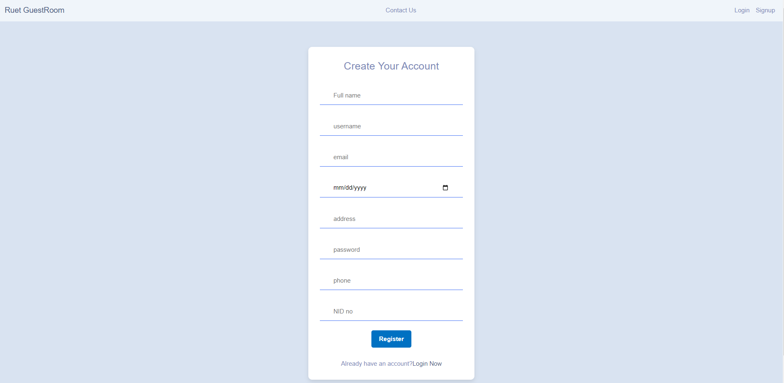
**Fig: Signup Screen**

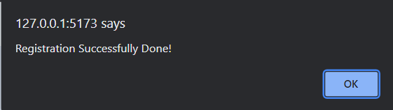

**Fig: A successful massage show, if registration successfully is done.**

### Login Screen

After Clicking the “Register” button, a Login box will appear. There are two button in the Login box Login and Register Now button. If the user enter the right username and password and click in the Login button then the home screen will appear. Else a pop-up box will come showing a “Login failed, Invalid credentials” message.

### Output


**Fig: Login Screen**

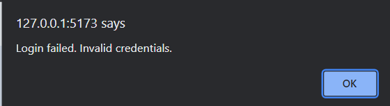

**Fig: A pop-up box will appear if the user username or password is wrong**

### Home Screen

After logging in to the website it will appear home screen. On the Home screen user can easily find the rooms according to date availability, room type, and room name. In the navbar, there is a button called user name, if a user clicks on that button he/she shows a profile and logout button. In the home page, if a user selects the date range, room type and room name the screen refreshes automatically. A hidden button will appear in the available room is “Book Now”. There is also a “View Details” to see the room description.

### Output

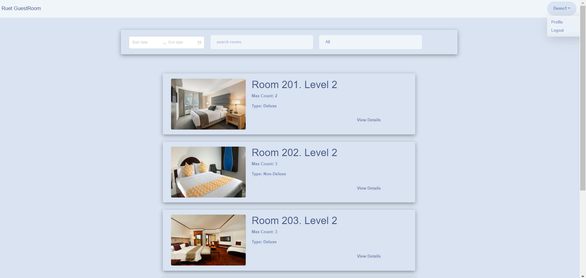
**Fig: Home Page**

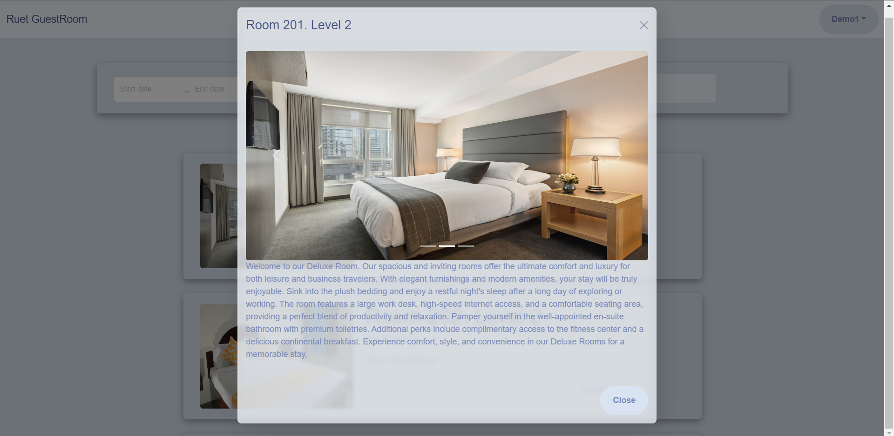
**Fig: A pop-up screen will appear after clicking “View Details”**

When a user clicks the “Book Now” button a booking screen will appear
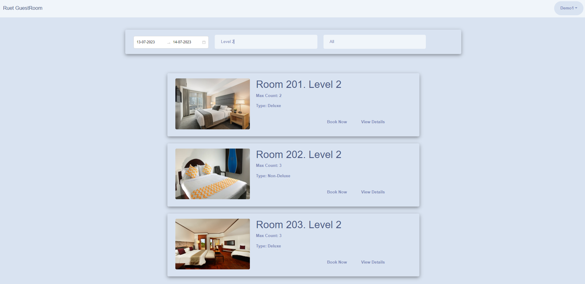
**Fig: Home Screen after filtering the rooms**

### Booking Screen

In the “Booking Screen”, a user can see every detail such as rent per day, check-in check-out date, the total amount, room name, max people count, and user name. At the bottom, a “Pay Now” button is available for the confirmation of booking and pay the amount.

### Output

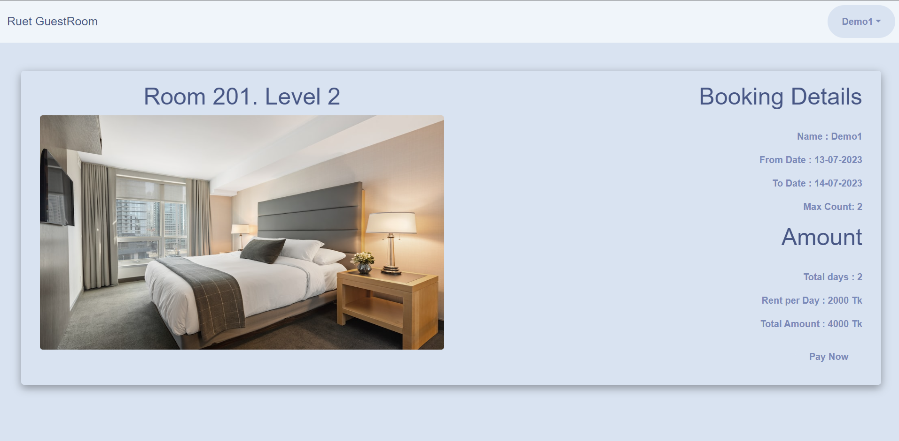
**Fig: Booking Screen**

### Pay Now

After clicking the pay now button, it will appear a term and condition page and a if a user is agreed to the terms and conditions the a payment gateway like Stripe will appear where and user can easily pay for the room.

### Output

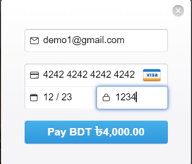

**Fig: Payment Box**

After filling up all the details and clicking the pay button the exact amount will pay for that room and a window alert will appear.

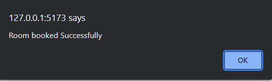

**Fig: Window alert of successful room booking**

After clicking “Ok” it will redirect to the Home Screen.

### Profile Screen

When a user goes to his profile he/she can see the details about his account

### Output

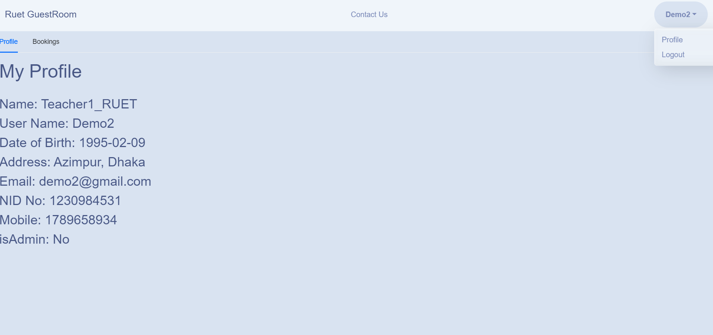
**Fig: Profile**

and a bookings screen where a user cancels or sees his/her all booking details.

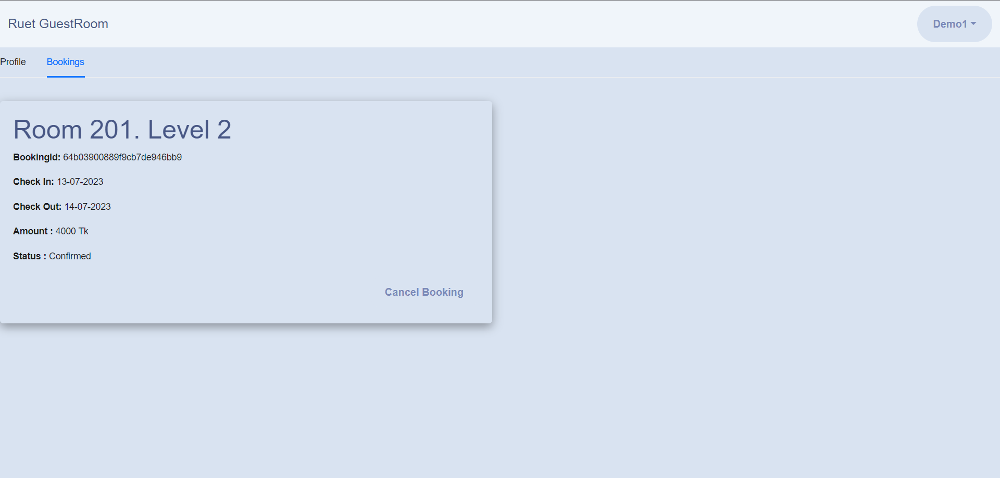
**Fig: Bookings details**

### Admin Screen

When a user is logging in as an admin, the user directly goes to the Admin panel. As a admin, he/she can see the all booking details like this

### Output

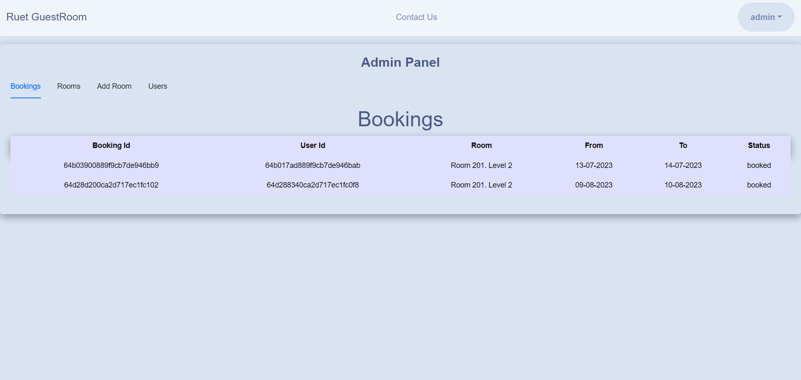
**Fig: Bookings**

### Rooms

And there are also Rooms, Add Room and User buttons. In Rooms, we can see all the rooms in out ruet guest room.

### Output

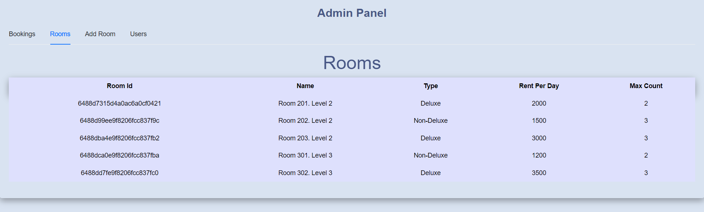
**Fig: Rooms**

### Add Room

In Add Room the admin need to fill the room name, rent per day , max count, description, room type, and some pictures of that room to create a new room

### Output

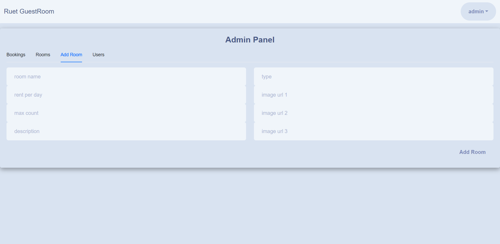
**Fig: Rooms**

After clicking the add room this page will redirect to the Home Screen with a successful massage alert.

### Users

Here the admin can see all the user details like, fullname username, userid, email, address, phone, nid no,isverified and isadmin option.

### Output

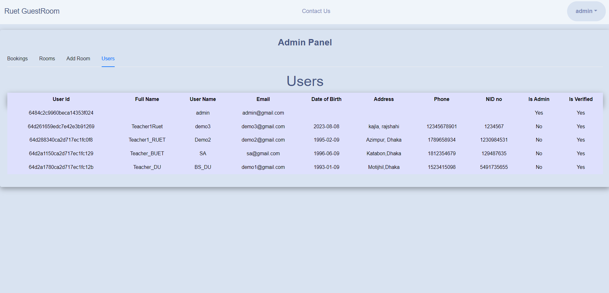
**Fig: Users**

## Logout

The “Logout” button on every page, will help the user or admin to log out from the website. Just by clicking on the “Logout” button, the user or admin will get logout from here and the next time whenever the admin wants to enter here, the admin has to log in by entering the right username and password in the login box.

## Database

The RUET Guest Room project utilizes MongoDB as its database solution, forming an integral part of the MERN (MongoDB, Express, React, Node.js) stack architecture. MongoDB, a NoSQL database, offers a flexible and scalable approach to storing and managing data.

### Database Schema

The database schema for the RUET Guest Room project is designed to efficiently organize and store relevant information for rooms, users, bookings, and other essential entities. Each collection within the database corresponds to a specific data type and is structured to facilitate data retrieval and manipulation.

### Mongoose

[Mongoose](https://mongoosejs.com/) is employed as the ODM (Object Data Modeling) library for MongoDB in this project. It provides a structured and intuitive way to interact with the database using JavaScript objects, simplifying tasks such as data validation, querying, and relationship management.

### Data Flow

1. **Rooms**: Information about available rooms, including room name, rent per day, max occupancy, room type, and images, is stored in the `rooms` collection.

2. **Users**: User details, including username, email, hashed password, address, phone number, and booking history, are stored in the `users` collection.

3. **Bookings**: Details about room bookings, such as check-in and check-out dates, total amount, room ID, user ID, and booking status, are stored in the `bookings` collection.

4. **Admin**: Administrative data, including admin username and password (hashed), can be added for secure access to the admin panel.

### MongoDB Configuration

Ensure that you have MongoDB installed and running locally or specify a connection string to a remote MongoDB instance in the project's configuration (usually in the `server.js` file). Mongoose provides an abstraction layer for working with MongoDB, allowing you to define models and interact with the database using JavaScript.

For local development, you can use the following connection URL in your `server.js` file:

```javascript
mongoose.connect('mongodb://127.0.0.1:5173/ruet-guest-room', {
  useNewUrlParser: true,
  useUnifiedTopology: true,
});
```

## Conclusion

In this project I have tried my best to make user friendly website. This website can be handled by any person who has little bit of idea of computers. In this website I have tried to meet most of the requirements of the present RUET Guest Room booking system including maintaining details of customers, and rooms. I also keep provision to update the details of customers, rooms. In my effort I have tried to make my website all the more user friendly but there may some features which I would like to include in my continuous attempts.
